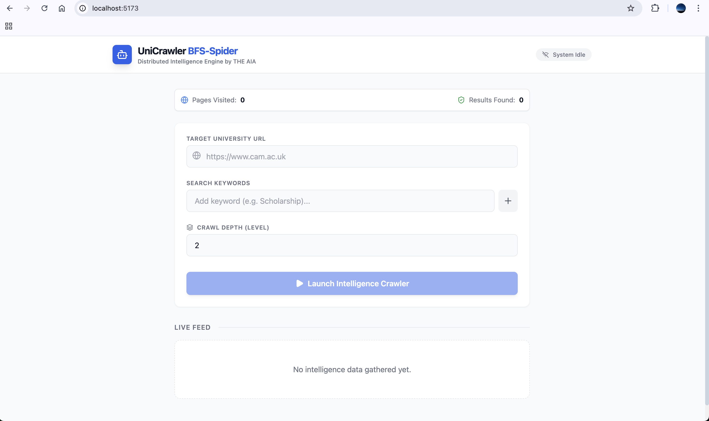
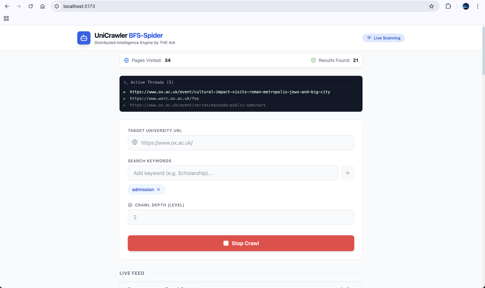

# **Project: UniCrawler BFS-Spider**

### **Mission Statement**

To build a scalable, distributed crawler capable of extracting specific intelligence (scholarships, admissions, research grants) from modern, complex university websites and streaming the results instantly to a user dashboard without persistent storage latency.

----------


# View Platform:


## **1. System Architecture**

The system follows a **Event-Driven, Stateless Architecture**. It is designed to be a "Pipe," not a "Bucket." Data flows through it; it doesn't stay in it.

### **The Data Flow (Lifecycle of a Request)**

1.  **Initiation:** User submits `cam.ac.uk` + `["Scholarship", "PhD"]` via React Frontend.
    
2.  **Dispatch:** FastAPI generates a `Job ID` (e.g., `job_123`) and pushes the seed URL to Redis Queue.
    
3.  **Connection:** React immediately subscribes to WebSocket channel `ws://api/stream/job_123`.
    
4.  **The Swarm:** 10+ Celery Workers (in Docker) pick up tasks in parallel.
    
    -   **Worker A** parses HTML.
        
    -   **Worker B** renders JavaScript (Playwright).
    
    -
    
    -

        
5.  **Discovery:** When a worker finds a match, it publishes the data to Redis Pub/Sub.
    
6.  **Delivery:** FastAPI's WebSocket listener catches the message and pushes it to React.
    
7.  **Visualization:** The user sees the result appear instantly on the dashboard.
    

----------


## Run the Project:

**Backend**
```
cd uni_crawler_backend
docker-compose up --build

```

**Frontend**
```
cd uni_crawler_frontend
npm run dev

```


## **2. Project Directory Structure**

The project is split into two distinct repositories/folders: `backend` and `frontend`.

### **A. Backend Structure (Python/FastAPI)**

Plaintext

```
uni_crawler_backend/
├── app/
│   ├── __init__.py
│   ├── main.py                  # Entry point (FastAPI App)
│   │
│   ├── api/                     # API Interface
│   │   ├── __init__.py
│   │   ├── routes.py            # POST /crawl (Starts job)
│   │   └── websocket.py         # WS /stream/{job_id} (Data Pipe)
│   │
│   ├── core/                    # Infrastructure
│   │   ├── config.py            # Loads .env variables
│   │   ├── celery_app.py        # Task Queue Configuration
│   │   └── redis_client.py      # Async Redis Connection
│   │
│   ├── crawler/                 # The Intelligence Engine
│   │   ├── __init__.py
│   │   ├── manager.py           # Logic: Decisions & Scoring
│   │   ├── fetcher.py           # Tool: Hybrid HTTPX/Playwright
│   │   ├── extractor.py         # Tool: Selectolax/PyPDF Parser
│   │   └── utils.py             # User-Agent rotation, URL cleaning
│   │
│   ├── tasks/                   # The Workers
│   │   ├── __init__.py
│   │   └── worker.py            # The Celery Task definitions
│   │
│   └── schemas/                 # Data Models
│       └── messages.py          # Pydantic models for WebSocket msgs
│
├── .env                         # Secrets (Redis URL, concurrency)
├── docker-compose.yml           # Orchestration
├── Dockerfile.api               # API Container Image
├── Dockerfile.worker            # Worker Container Image
└── requirements.txt             # Dependencies

```

### **B. Frontend Structure (React/TypeScript)**

Plaintext

```
uni_crawler_frontend/
├── public/
├── src/
│   ├── components/
│   │   ├── CrawlForm.tsx        # Input for URL & Keywords
│   │   ├── ResultsTable.tsx     # Live Data Grid
│   │   └── StatusBadge.tsx      # Connection Indicator
│   │
│   ├── hooks/
│   │   └── useCrawler.ts        # WebSocket & State Logic
│   │
│   ├── types/
│   │   └── index.ts             # TS Interfaces (CrawlResult)
│   │
│   ├── App.tsx                  # Layout
│   ├── main.tsx                 # Entry
│   └── index.css                # Tailwind Styles
│
├── package.json
├── tailwind.config.js
└── tsconfig.json

```

----------

# Page:







## **3. Detailed Functionality**

### **Backend Functionality**

#### **1. The Hybrid Fetcher (`app/crawler/fetcher.py`)**

-   **Smart Switching:**
    
    -   Tries `httpx` (Async HTTP) first for speed (100ms).
        
    -   If response body < 2kb or contains `<div id="root">`, it assumes a React App.
        
    -   **Fallback:** Launches `Playwright` (Headless Chromium) to execute JS and wait for content (2-5s).
        
-   **PDF Interception:**
    
    -   Detects `Content-Type: application/pdf`.
        
    -   Downloads bytes directly instead of parsing as HTML.
        

#### **2. The Universal Parser (`app/crawler/extractor.py`)**

-   **HTML:** Uses `selectolax` to remove "noise" (navbars, footers, sidebars).
    
-   **PDF:** Uses `pypdf` to extract text layers from documents.
    
-   **Keyword Scoring:** Checks if keywords (e.g., "Scholarship") appear in the _content area_, not just the menu.
    

#### **3. The Real-Time Stream (`app/api/websocket.py`)**

-   **Pub/Sub:** Uses Redis Channels.
    
-   **Mechanism:**
    
    -   `Frontend` connects to `ws://.../stream/job_123`.
        
    -   `Worker` finds data -> `redis.publish('job_123', json_data)`.
        
    -   `WebSocket` receives -> `await websocket.send_json(data)`.
        

#### **4. Distributed Workers (`app/tasks/worker.py`)**

-   **Concurrency:** Runs multiple worker processes per container.
    
-   **Deduplication:** Uses a Redis Set (`visited:job_123`) to ensure no URL is crawled twice.
    
-   **Recursion:** If a worker finds a new link on the same domain, it pushes it back to the queue for _another_ worker to pick up.
    

----------

### **Frontend Functionality**

#### **1. The Dashboard (`App.tsx`)**

-   **Input:** Accepts a target URL and a list of tags (keywords).
    
-   **State:** Tracks `Connecting`, `Scanning`, `Idle`.
    

#### **2. The Live Hook (`useCrawler.ts`)**

-   **Connection Management:** Automatically opens/closes WebSockets.
    
-   **Buffer:** Appends new results to the top of the list (`[new, ...old]`).
    
-   **Error Handling:** Detects if the backend disconnects and alerts the user.
    

#### **3. The Visualization (`ResultsTable.tsx`)**

-   **Instant Feedback:** Rows animate in as they arrive. Row after Row.
    
-   **Context:** Shows a text snippet (context) of where the keyword was found (e.g., "...students are eligible for the **Full Ride Scholarship** if...").
    
-   **Action:** Provides a direct link to the source page/PDF.
    

----------


<br>
<br>
<br>


# Concept Implemented In this Project:


### **Core Architecture & Design**

-   **Event-Driven Architecture:** The system reacts to events (user requests, found links) rather than storing state in a traditional database.
    
-   **Stateless Design ("Pipe not Bucket"):** Data is streamed instantly to the client rather than being saved to a persistent disk database, reducing latency.
    
-   **Microservices Pattern:** Separation of concerns between the API server (FastAPI) and the background workers (Celery).
    

### **Concurrency & Distributed Systems**

-   **Distributed Task Queues:** Using **Celery** to manage and distribute scraping jobs across multiple workers.
    
-   **Parallel Processing:** Running a "swarm" of workers to process multiple URLs simultaneously.
    
-   **Pub/Sub Messaging:** Using **Redis** to broadcast messages from workers to the API for real-time delivery.
    

### **Web Scraping & Algorithms**

-   **Breadth-First Search (BFS):** The crawling algorithm that explores neighbor nodes (links) layer by layer.
    
-   **Hybrid Rendering Strategy:** Smart switching between lightweight HTTP requests (**HTTPX**) and heavy headless browsing (**Playwright**) based on page complexity.
    
-   **Recursive Crawling:** Workers triggering new jobs for discovered links within the same domain.
    
-   **Set-Based Deduplication:** Using Redis Sets to track visited URLs in O(1) time to prevent infinite loops.
    


### **Frontend & Real-Time UX**

-   **WebSocket Communication:** Establishing persistent, bi-directional connections for live data streaming.
    


<br>
<br>

# How Implemented:


Here is the mapping of your **High-Level Concepts** to your specific **File Structure**.

This serves as a technical tour of your codebase.

----------

### **1. Core Architecture & Design**

-   **Microservices Pattern**
    
    -   **Where:** `docker-compose.yml`
        
    -   **How:** You defined two distinct services: `api` (the brain/interface) and `worker` (the muscle). They scale independently. If you need 50 crawlers, you just scale the `worker` container, while the `api` container stays the same.
        
-   **Stateless Design ("Pipe not Bucket")**
    
    -   **Where:** `app/api/websocket.py` & `app/tasks/worker.py`
        
    -   **How:** Notice that `worker.py` **never** does `database.save()`. Instead, it does `redis_client.publish()`. The data exists only for the millisecond it takes to travel from the Worker $\to$ Redis $\to$ WebSocket $\to$ React.
        

----------

### **2. Concurrency & Distributed Systems**

-   **Distributed Task Queues (Celery)**
    
    -   **Where:** `app/core/celery_app.py`
        
    -   **How:** This file configures Celery to use Redis as a "Broker". It tells the system: "When I say `crawl_task.delay()`, don't run it here. Package it up and send it to Redis for any available worker to grab."
        
-   **Parallel Processing (The Swarm)**
    
    -   **Where:** `app/tasks/worker.py` (specifically `@celery_app.task`)
        
    -   **How:** When you run `docker-compose up --scale worker=4`, you spin up 4 copies of this file. They all listen to the same queue and process different URLs simultaneously.
        
-   **Pub/Sub Messaging**
    
    -   **Where:** `app/api/websocket.py` (The Subscriber) & `app/tasks/worker.py` (The Publisher)
        
    -   **How:**
        
        -   **Worker:** `redis_client.publish(f"job:{job_id}", json_payload)` (Shouts the result).
            
        -   **API:** `pubsub.subscribe(f"job:{job_id}")` (Listens for the result and pushes it to the socket).
            

----------

### **3. Web Scraping & Algorithms**

-   **Breadth-First Search (BFS)**
    
    -   **Where:** `app/tasks/worker.py`
        
    -   **How:** The `level` parameter acts as the BFS depth tracker.
        
        -   **Start:** User requests `level=2`.
            
        -   **Logic:** The worker finds links and calls `crawl_page_task.delay(..., level=level-1)`.
            
        -   **Stop:** When `level=0`, the recursion stops. This ensures you scan "neighbors" before going deeper.
            
-   **Hybrid Rendering Strategy**
    
    -   **Where:** `app/crawler/fetcher.py`
        
    -   **How:** The `fetch` method has an `if/else` block.
        
        -   **Step 1:** Try `httpx.get()` (Fast, 0.1s).
            
        -   **Step 2:** If the response is tiny or empty (React app), catch the error and switch to `_fetch_with_browser()` (Playwright, 3s).
            
-   **Recursive Crawling & Domain Guard**
    
    -   **Where:** `app/crawler/utils.py` (Function `is_same_domain`)
        
    -   **How:** Before triggering a new crawl task, the worker checks:
        
        `if URLUtils.is_same_domain(current_url, new_link): crawl_task.delay(...)`
        
        This ensures your bot doesn't accidentally wander off from `harvard.edu` to `facebook.com`.
        
-   **Set-Based Deduplication (O(1))**
    
    -   **Where:** `app/tasks/worker.py`
        
    -   **How:**
        
        Python
        
        ```
        if redis_client.sismember(f"visited:{job_id}", url): return
        redis_client.sadd(f"visited:{job_id}", url)
        
        ```
        
        This leverages Redis Sets to instantly check if a URL has been seen, even if you have processed 1 million pages.
        

----------

### **4. Frontend & Real-Time UX**

-   **WebSocket Communication**
    
    -   **Where:** `src/hooks/useCrawler.ts`
        
    -   **How:**
        
        TypeScript
        
        ```
        const ws = new WebSocket(`ws://localhost:8000/api/stream/${jobId}`);
        ws.onmessage = (event) => { setResults(...) };
        
        ```
        
        This hook manages the persistent connection. It listens for the "pings" from the backend and updates the React state essentially frame-by-frame.
        
-   **Data Visualization ("The Waterfall")**
    
    -   **Where:** `src/components/ResultsTable.tsx`
        
    -   **How:** The `results` array in React is prepended (`[newItem, ...oldItems]`). The table renders this array. Because the updates happen in real-time, the user sees rows "slide down" as the crawler discovers them.


